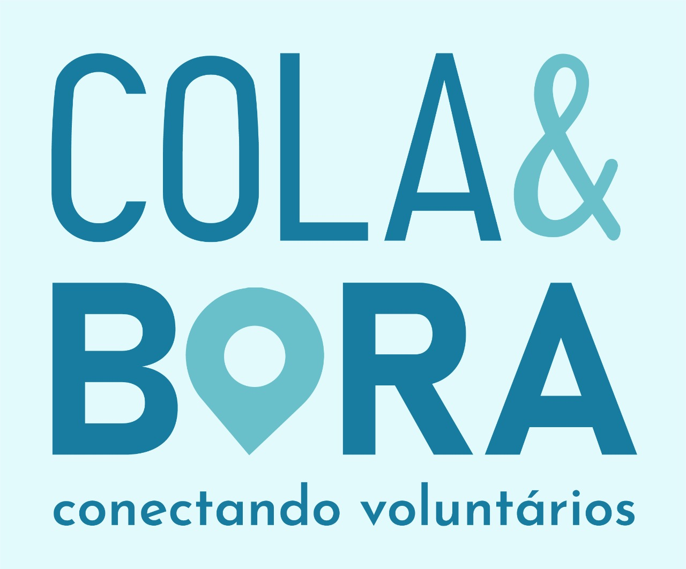

# Colabora

## O que é o Colabora?

O _Cola&Bora_ é um projeto que surgiu na Universidade Federal de Pernambuco (UFPE), na cadeira "Projetão".
É o resultado de um processo de _Design Thinking_, cujo o objetivo era criar uma solução que proporcionasse maior
eficiência a realização de ações sociais realizadas na cidade do Recife - PE.

Aqui é possível ver um [vídeo](https://www.youtube.com/watch?v=Qu9z8bkEfYw) de apresentação do projeto

Indo além das fronteiras da universidade, o _Cola&Bora_ foi um projeto participante da 10ª edição do Campus Mobile.
Nele, o projeto passou por mentoria com especialistas de ESG e projetos de impacto social, onde ganhou maturidade e foi
[finalista](https://www.institutoclaro.org.br/nossas-novidades/conheca-os-finalistas-da-10a-edicao-do-campus-mobile/) na
categoria _"Smart Cities"_.

## Funcionalidades e Casos de Uso

O _Cola&Bora_ tem como principal usuário o **Voluntário**, um voluntário cadastrado na plataforma pode:

1. Criar uma nova **Organização Social**
2. Criar uma nova **Ação Social** de uma Organização
3. Visualizar **Participantes** de uma Ação Social
4. Visualizar outras Organizações Sociais existentes
5. Participar de **Ações Sociais** divulgadas na plataforma

### Organizações Sociais

As Organizações Sociais são fundamentais para o funcionamento do Cola&Bora. Uma Organização Social é cadastrada
por um voluntário. Após cadastrada, é possível atribuir Ações Sociais a serem realizadas pela Organização, sendo
atribuídas pelo voluntário que a cadastrou.

Elas são consideradas instituições que credibilizam as Ações Sociais realizadas. É possível ver quais ações sociais
estão associadas à organização social ao consultar suas informações.

### Ações Sociais

Uma Ação Social necessariamente deve estar associada a uma Organização Social. Uma Ação Social deve descrever seus
objetivos, áreas de atuação e demais detalhes, como quando e onde irá ocorrer, além dos participantes.

## Como executar o projeto

Antes de tudo, para executar o projeto no seu computador é necessário ter os seguintes requisitos:

- SDK do .NET 6
- Docker e Docker Compose
- Clone deste repositório

Após cumpridos os requisitos anteriormente descritos, seguir os seguintes passos:

1. Abra o terminal na raiz do repositório clonado
2. Inicie o docker com o comando a segur:
   > $ sudo service docker start
3. Execute o arquivo docker-compose.yml
   > $ sudo docker-compose up -d
4. Vá até a pasta "src/Colabora.WebAPI" e execute o projeto
   > $ cd src/Colabora.WebAPI   $ sudo dotnet run
5. Abra a url **"https://localhost:5000"** seu navegador para acessar o Swagger

## Tecnologias utilizadas

O _Cola&Bora_ é um projeto idealizado através do conceito _Mobile First_, ou seja, levando em consideração
a usabilidade em dispositivos móveis primeiro. Neste repositório está contida a implementação do **backend** do
Cola&Bora, cujo disponibiliza uma API completa para viabilidade inicial do projeto, cujo será descrita a seguir.

O backend do _Cola&Bora_ foi construído utilizando as seguintes ferramentas:

- ASP.NET Core com .NET 6
- MediatR
- Entity Framework Core
- SQL Server
- FluentValidation
- Google OAuth
- Swagger
- xUnit (Testes)
- NSubstitute (Testes)
- FluentAssertions (Testes)
- Bogus (Testes)